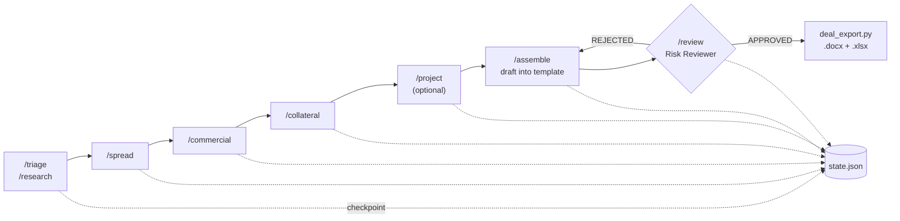
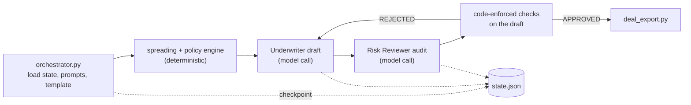

# Architecture

How OpenCAM Framework is put together: the two agents, the two ways to run it, how a deal moves through the
pipeline, where its state lives, and where the code that must be right is separated from the model that must be
checked. For the commands and scripts themselves, see the reference pages linked from the
[documentation index](README.md).

## The idea in one paragraph

A **Maker** (the Underwriter agent) drafts a Credit Assessment Memorandum (CAM) from source documents and
user-supplied risk inputs; an independent **Checker** (the Risk Reviewer agent) audits the draft and returns
`APPROVED` or `REJECTED` with revision notes. Everything that can be computed deterministically (ratios,
covenant results, required conditions, security gaps) is computed by code, handed to both agents as ground
truth, and enforced by code on the draft, so the agents narrate and judge rather than calculate. Every step
checkpoints its results to a per-deal `state.json`, so nothing important lives only in a conversation. The
result is exported as an editable `.docx` and an auditable `.xlsx` (a research-only deal run through `/research` exports a standalone `.docx` brief instead).

## Two ways to run it

Both paths share the deterministic core (spreading, the policy engine and its checks, state handling, export),
the state model, the templates, and the style-guide and credit-policy configuration. The full-CAM workflow
(`/triage` through `/assemble`, or `orchestrator.py`) is available through both and produces the same `.docx` and
`.xlsx`. Some capabilities are specific to one interface: `/research` (a standalone research brief, exported as a
`.docx` through `research_export.py`, with no financials, no CAM and no workbook) and `/calibrate-policy` exist
only as Claude Code commands, and so does the interactive confirmation behind persisted conventions (the
headless pipeline can inherit what has been confirmed but cannot create it). The two paths differ in **who calls
the model, how it is authenticated and what it costs**.

| | Claude Code slash commands | Headless Python scripts |
| :--- | :--- | :--- |
| Entry points | `/calibrate`, `/calibrate-policy`, `/triage`, `/research`, `/spread`, `/commercial`, `/collateral`, `/project`, `/assemble`, `/review` (`/research` and `/calibrate-policy` have no headless equivalent) | `scripts/calibrate.py`, `scripts/orchestrator.py` (and the local evaluation harness, `scripts/run_evals.py`) |
| Where it runs | Interactively, inside a Claude Code session opened on this repository | From a terminal, a scheduler or CI |
| Who calls the model | Claude Code itself, as the model running your session | The `anthropic` Python SDK, from `scripts/` |
| Authentication | Your Claude Code login. **No `ANTHROPIC_API_KEY` is needed or read.** | `ANTHROPIC_API_KEY` in the environment of the process |
| Billing | Whatever your Claude Code plan covers | Per-token Anthropic **API** billing, separate from any Claude Code subscription |
| What stays local | Your files, `state.json`, the generated documents, and the deterministic scripts the commands run through Bash (`spreading_check.py`, `policy_check.py`, `deal_export.py`, ...) | The same files and scripts |
| What goes to an external service | What the session sends to Claude Code's model while it works (the prompts, the documents it reads, the figures you give it); the public web pages and filings a research step is told to fetch | The prompts and documents the script sends to the Anthropic API |
| Without a key | Not applicable | `calibrate.py` falls back to `--mock` (placeholder output, no API call); `orchestrator.py` fails at its first model call with a missing-credentials error and sends nothing |
| Offline testing | The deterministic scripts and the test suite need no network | The test suite uses fake clients: no key, no network |

Two boundaries to keep in mind:

- **Credentials.** The only credential the framework uses is the `ANTHROPIC_API_KEY` environment variable, and
  only the headless scripts read it. Set it in your own shell; never write it into a file in this repository
  (`config/settings.json` is git-tracked and is not read for keys), never put it in a deal folder, a prompt or a
  command, and never paste a live key into an AI assistant's chat, where it ends up in transcripts and logs. A
  `.env` file and `*.key` files are git-ignored as a safety net, but nothing in the framework reads a `.env`
  file. See [Configuration](configuration.md#credentials).
- **Live model calls from the tests and the evaluation harness.** The test suite never makes a model call. The
  evaluation harness only does so when you run `python scripts/run_evals.py --live` yourself, with your own key,
  under a hard call cap, on synthetic data. See [Evaluation](evaluation.md).

## The deal pipeline



Each step reads `state.json` first and writes its own results back when it finishes (the
[checkpoint and re-hydration rules](../CLAUDE.md#context-window--state-management-protocol) are normative).
`/research` is a shorter route for a deal that needs only the Go/No-Go screen and company research: it writes
the same `triage` and `commercial` state a full run would, so the deal can continue into `/spread` later.

The headless pipeline is the same loop in one process:



## Where the code ends and the model begins

| Layer | Decides | Examples |
| :--- | :--- | :--- |
| Deterministic code | What can be computed or checked exactly | Subtotals and ratios (`spreading_builder.py`, run through `spreading_check.py`); covenant PASS / FAIL / UNRESOLVABLE, required conditions precedent and subsequent, security gaps (`policy_engine.py`); whether a draft declares every required item and states figures that match the computed ones (`policy_checks.py`); state validation and schema versioning (`state_manager.py`); document export |
| Model, constrained by the prompts | Narrative, grounding in sources, judgement about ambiguity | The Underwriter's drafting; the Risk Reviewer's challenge of unsourced claims and weak mitigants |
| Human | Credit judgement and confirmation | Risk inputs (PD, LGD, bureau score); whether a spreading convention or a policy interpretation is confirmed for reuse; the final decision on a CAM |

A code-enforced rejection overrides a Risk Reviewer `APPROVED`. A passing deterministic check shows that the
draft is consistent with the computed facts and complete against the deal's own structure; it does not show that
the narrative is sound.

## Components

- **Agents** (`agents/underwriter_agent.md`, `agents/risk_reviewer_agent.md`): the two role prompts, kept
  independent on purpose (see [Decisions](decisions.md)). `config/system_instructions.md` is a short statement of
  the framework's principles; no script or command loads it.
- **Slash commands** (`.claude/commands/`): the interactive implementation of each step, described by
  `config/skills_registry.md`. They run the deterministic scripts through Bash steps and hand the model's
  drafting work back to the session.
- **Scripts** (`scripts/`): the deterministic core and the headless entry points. Most have no `anthropic`
  dependency so they can run from a slash command's Bash step and be tested without a model.
- **Templates** (`templates/`): shipped generic CAM templates, plus git-ignored local overrides derived from your
  own documents.
- **State** (`deals/<Company>/<Proposal>_<Date>/state.json`, git-ignored): the checkpoint of every step, with
  `sources/` beside it for the documents the claims rest on.
- **Tests and CI**: the suite, golden snapshots, coverage floors, a weekly mutation run, and a local-only
  evaluation harness for the model's behaviour.

## Maker-Checker agents

| Agent | File | Role |
| :--- | :--- | :--- |
| Underwriter ("Maker") | [`agents/underwriter_agent.md`](../agents/underwriter_agent.md) | Drafts the CAM: calculates TNW, EBITDA, DSCR, Gross Leverage, Working Capital Days; cites sources for every qualitative claim; never invents figures; discloses when spreading was analyst-supplied rather than independently recomputed; drafts with awareness of a calibrated credit policy and any persisted deal learnings once they exist. |
| Risk Reviewer ("Checker") | [`agents/risk_reviewer_agent.md`](../agents/risk_reviewer_agent.md) | Independently audits the draft: re-verifies ratio calculations, flags ungrounded assertions or missing sources, challenges weak mitigants, flags any violation of a calibrated credit policy (mandatory, once one exists), and returns `APPROVED` or `REJECTED` with revision notes. |

The two prompts are kept deliberately independent — the Reviewer's value comes from auditing
the Maker's work cold, not from sharing its reasoning.

### Grounding rule

Every fact in a generated CAM — company history, market/competitor data, management bios,
financial figures — must trace back to a verified, credible source: audited financial
statements, a company's own filings/website, a recognized credit bureau or rating agency
report, or another primary document you supply. Neither agent should ever estimate or invent a
figure it cannot source. Where no external rating system or in-house scoring tool (e.g. a
Moody's/bureau integration) is wired up, PD/LGD grades are **user-supplied inputs** (via the
`--pd` / `--lgd` flags) and are labelled as such in the output — the framework does not pretend
to have scored the risk itself.

## Slash commands and the agents

`/triage`, `/research`, `/spread`, `/commercial`, `/collateral`, and `/project` each load
[`agents/underwriter_agent.md`](../agents/underwriter_agent.md)'s role; `/review` loads
[`agents/risk_reviewer_agent.md`](../agents/risk_reviewer_agent.md)'s. `/assemble` resolves the
right CAM template (local override, else shipped default), drafts into it, loops `/review` until
`APPROVED`, then calls [`scripts/deal_export.py`](../scripts/deal_export.py) — the folder-creation
and `.docx`/`.xlsx` export logic, factored out of `orchestrator.py` specifically so it has no
`anthropic` dependency and can run from a slash command's Bash step. `/research` calls the
lighter [`scripts/research_export.py`](../scripts/research_export.py) instead, so a research-only
deal never triggers the full-CAM side effects (template auto-save, `.xlsx` export).

## Repository map

The complete annotated tree, as maintained in `CLAUDE.md` before it was relocated here, follows. `CLAUDE.md`
keeps a short file map for orientation.

```
open-cam-framework/
├── .claude/commands/             Slash-command interface (primary) -- see "Slash commands" in `CLAUDE.md`
│   ├── calibrate.md, calibrate-policy.md
│   ├── triage.md, research.md, spread.md, commercial.md, collateral.md, project.md
│   ├── assemble.md
│   └── review.md
├── agents/                      Maker-Checker agent prompts (see Maker-Checker agents above)
│   ├── underwriter_agent.md
│   └── risk_reviewer_agent.md
├── config/
│   ├── settings.json            maker_model (required) -- also optional checker_model/maker_temperature/
│   │                            checker_temperature to independently configure the Risk Reviewer vs the
│   │                            Underwriter (both default to the Underwriter's own model/no override when
│   │                            unset), and an optional calibrate_model for scripts/calibrate.py (defaults
│   │                            to maker_model when unset -- calibration has no need for a structurally
│   │                            different model the way the Checker does). max_tokens/default_currency/
│   │                            output_directory/template_directory/spreading_template_directory are also
│   │                            accepted in the file but not read by any script -- see "What
│   │                            config/settings.json actually controls" in `CLAUDE.md`
│   ├── skills_registry.md       Slash-command registry: /calibrate /calibrate-policy /triage /research /spread /commercial /collateral /project /assemble /review
│   ├── system_instructions.md   Principles statement (reference text; no script or command loads it)
│   ├── style_guide.md           Generated by /calibrate or scripts/calibrate.py (not checked in until first run)
│   ├── credit_policy.md         Generated by /calibrate-policy (not checked in until first run) -- this fork's own calibrated institutional credit policy, referenced during every future CAM draft/audit
│   ├── credit_policy_notes.md   Generated/appended by /review on explicit analyst confirmation (not checked in until first note) -- persisted corrections to how specific credit-policy clauses have been interpreted, referenced alongside credit_policy.md (see "Persisted conventions" in `CLAUDE.md`)
│   ├── spreading_conventions.json  Generated/updated by /spread on explicit analyst confirmation -- enterprise-wide (not per-borrower) spreading convention, see scripts/conventions.py and "Persisted conventions" below
│   └── deal_learnings.md        Generated/appended by /assemble on explicit analyst confirmation (not checked in until first entry) -- enterprise-wide end-of-deal takeaways, see "Persisted conventions" in `CLAUDE.md`
├── scripts/
│   ├── calibrate.py             Headless style + template calibration entry point (needs ANTHROPIC_API_KEY)
│   ├── orchestrator.py          Headless deal pipeline entry point (needs ANTHROPIC_API_KEY)
│   ├── deal_export.py           Folder creation + template auto-save + .docx/.xlsx export (no anthropic dependency; shared by orchestrator.py and /assemble)
│   ├── research_export.py       Standalone research-brief -> .docx export (no anthropic dependency; used by /research only -- kept separate from deal_export.py so a research-only deal never triggers CAM-specific side effects)
│   ├── state_manager.py         Reads/writes deals/<Company>/<Proposal>_<Date>/state.json (no anthropic dependency; see "Context Window & State Management Protocol")
│   ├── source_manifest.py       Saves fetched/given source material (PDFs, saved pages) into that deal's sources/ subfolder plus a manifest -- see "Source material persistence" in `CLAUDE.md` (no anthropic dependency)
│   ├── conventions.py           Reads/writes persisted analyst-confirmed spreading conventions -- borrower-specific (deals/<Company>/_conventions.json) and enterprise-wide (config/spreading_conventions.json); checked (never silently applied) by /spread before asking which mode applies -- see "Persisted conventions" in `CLAUDE.md` (no anthropic dependency)
│   ├── policy_engine.py         Deterministic covenant/security/CP/CS evaluation -- evaluate_deal_policy() (no anthropic dependency; see "Execution scripts" in `CLAUDE.md`)
│   ├── policy_checks.py         Parses the Underwriter's structured-output JSON and checks a draft's declared figures/CPs/taxonomy against ground truth -- check_draft_compliance() (no anthropic dependency)
│   ├── transcription_check.py   Read-back, cross-foot and digest-gated commit for /spread figures transcribed from an image (no anthropic dependency; see docs/financial-model.md)
│   ├── policy_check.py          Standalone CLI wrapper around policy_engine.py/policy_checks.py -- compute(); callable from /assemble's and /review's own Bash steps so the slash-command interface gets the same code-enforced governance orchestrator.py's headless pipeline does (no anthropic dependency)
│   ├── pii_scan.py              Heuristic (UK-shaped) scan for likely-real PII left over in a calibrated template before promoting it upstream -- see the "Promoting a local override upstream" rule in `CLAUDE.md`'s confidentiality section (no anthropic dependency)
│   ├── textio.py                The repo's one text-reading policy: strict UTF-8 for shipped files, UTF-8-then-cp1252-with-warning for user-owned legacy files, never character substitution -- see issue #137 (no anthropic dependency; see "Execution scripts" in `CLAUDE.md`)
│   ├── run_evals.py             CLI for the local live-model evaluation harness (explicit invocation only: --validate/--list/--dry-run make zero model calls; --live spends real API calls under a hard cap; --export-baseline/--compare) -- with eval_cases.py (dataset schema/validation), eval_oracles.py (deterministic oracles), eval_report.py (results + review pack), eval_budget.py (hard call cap), eval_runner.py (the isolated live runner), eval_baseline.py (baseline export/compare); see "Execution scripts" in `CLAUDE.md` and issue #151
│   ├── check_test_count.py      Parses pytest's own "N passed" summary line and compares it against badges/test-count.json (`--write` updates the file by hand) -- CI's code-enforced guard against that count going stale (no anthropic dependency; see "Execution scripts" in `CLAUDE.md`)
│   ├── check_coverage.py        Checks coverage.py's JSON report against the floors in pyproject.toml -- overall plus a higher per-module floor for the eight governance modules; CI's code-enforced coverage gate (no anthropic dependency; see "Testing and static analysis" in `CLAUDE.md`)
│   ├── mutation_report.py       Per-module mutation score + completeness report from `mutmut results --all true`, run by the weekly mutation workflow -- diagnostic only, never fails over a score (no anthropic dependency; see "Testing and static analysis" in `CLAUDE.md`)
│   ├── docx_builder.py          Markdown -> .docx export helper
│   ├── spreading_builder.py     Financial spreading -> .xlsx export helper
│   ├── spreading_check.py       Standalone CLI wrapper around spreading_builder.py's formula evaluation -- compute(); callable from /spread's and /project's own Bash steps so the slash-command interface gets the same code-enforced subtotal/ratio computation orchestrator.py's headless pipeline does (no anthropic dependency; see "Execution scripts" in `CLAUDE.md`)
│   └── template_resolver.py     Resolves default vs. calibrated-override CAM template paths
├── templates/                   Reference templates -- see templates/README.md
│   ├── cam/                     Shipped default Markdown CAM templates (corporate_credit_cam.md, asset_finance_cam.md)
│   ├── spreading/               default_spreading_template.xlsx -- reference copy of the spreading workbook layout
│   └── local/cam/               Calibrated overrides / auto-saved new-type templates (gitignored, see security.md)
├── evals/                       Local live-model evaluation harness data -- see evals/README.md and issue #151: dataset/<version>/ (synthetic cases, tracked), results/ (per-run output, gitignored), baselines/ (committed only by a deliberate manual step)
├── tests/                       Pytest suite (spreading_builder formulas, docx table rendering, template resolution, state persistence, property-based tests, golden .docx/.xlsx snapshots in snapshots/, synthetic state fixtures in fixtures/) -- see "Testing and static analysis" in `CLAUDE.md`
├── badges/
│   └── test-count.json          Checked-in `{"passed": <int>}` record of the currently-passing test count -- deliberately public/git-tracked (a project stat, not derived borrower/institutional data), kept honest by CI's "Verify checked-in test count" step (scripts/check_test_count.py) rather than hand-maintained -- see "Execution scripts" in `CLAUDE.md`
├── deals/                       Generated output, one subfolder per `[Company]/[Proposal]_[Date]` -- each also holds that deal's state.json and a sources/ subfolder (see "Source material persistence" in `CLAUDE.md`); a company also optionally holds a `_conventions.json` and a `_learnings.md` one level up, above its dated proposal folders (see "Persisted conventions" in `CLAUDE.md`)
├── inputs/calibration_samples/  Historical CAM PDFs used as calibration input (gitignored/local)
├── requirements.txt
├── pyproject.toml               Central tool configuration (no project metadata): ruff rules, pytest options, coverage -- see "Testing and static analysis" in `CLAUDE.md`
├── requirements-dev.txt         requirements.txt + pytest, pytest-cov/-timeout/-socket, hypothesis, diff-cover, ruff, bandit
├── requirements-security.txt    pip-audit + zizmor, installed only by CI's `security` job
├── requirements-mutation.txt    mutmut, installed only by the weekly mutation workflow
├── .github/workflows/mutation.yml  Weekly + manual mutation testing of the eight governance modules (diagnostic report, never a merge gate)
├── .github/workflows/ci.yml     CI: `test` (Ubuntu, coverage + floors), `test-windows`, `runtime-smoke` (requirements.txt only), `security` (pip-audit, zizmor) -- see "Testing and static analysis" in `CLAUDE.md`
└── README.md
```

Not shown in the tree: `docs/` (this documentation corpus, indexed by [README.md](README.md), with the synthetic worked deal in `docs/examples/synthetic_co/`), `CLAUDE.md`, `LICENSE`, `.gitignore` and `.github/dependabot.yml`.
