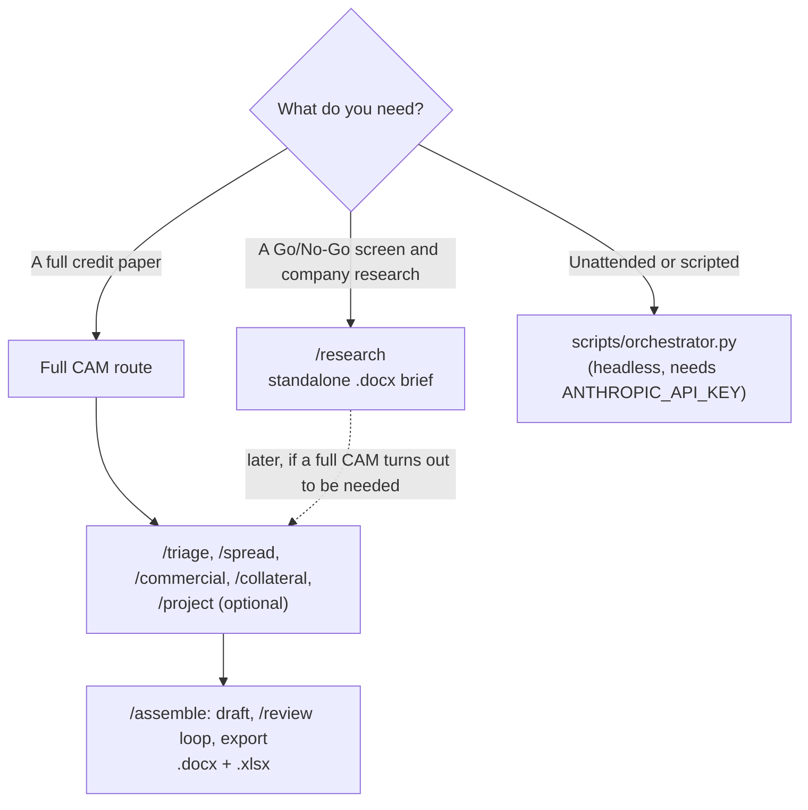
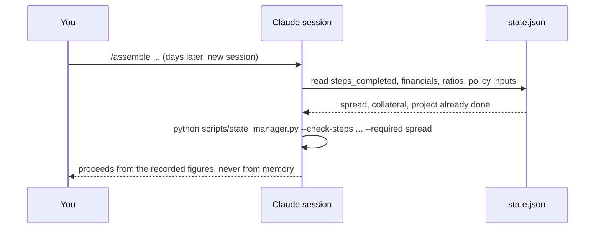

# Workflows

End-to-end walkthroughs of the framework, in both execution modes, using one synthetic deal throughout:
**Synthetic Co** asking for the **Synthetic Fleet Loan** (a five-year term facility; all figures are in invented
"synthetic units"). The input files used below are checked in under
[`examples/synthetic_co/`](examples/synthetic_co/), and `tests/test_docs_examples.py` re-runs them, so the numbers
and messages on this page are the ones the scripts really produce. Nothing here is a real borrower, filing or
figure.

For what each command asks for and writes, see the [command reference](commands.md); for every script's flags, the
[CLI reference](cli-reference.md); for what the figures mean, the [financial model](financial-model.md).

## Choose a route



## The two execution modes

| | Claude Code slash commands | Headless Python scripts |
| :--- | :--- | :--- |
| You run | `/triage`, `/spread`, ... in a Claude Code session opened on this repository | `python scripts/orchestrator.py ...` in a terminal |
| The model is called by | Claude Code, as the session you are already in | The `anthropic` SDK, from the script |
| Authentication | Your Claude Code login. No `ANTHROPIC_API_KEY` is needed or read | `ANTHROPIC_API_KEY` in the process environment |
| Billing | Your Claude Code plan | Per-token Anthropic **API** billing |
| Available | Everything, including `/research` and `/calibrate-policy` | `calibrate.py` and `orchestrator.py` (the full CAM only), plus the local evaluation harness |
| Offline | The deterministic scripts and the tests need no network | `calibrate.py --mock`, the tests, and `run_evals.py --dry-run` make no model call |

Credentials belong in your own shell's environment and nowhere in this repository; see
[Configuration](configuration.md#credentials). The worked examples below mark each step **(local)** when it runs
only deterministic code on your machine, and **(model)** when the model drafts or judges.

## Calibration (set up once)

**Use it when** you want drafts to follow your house style and layout. **Needs** a few of your own past CAMs as PDFs
in `inputs/calibration_samples/` (git-ignored). **Writes** `config/style_guide.md` and
`templates/local/cam/<deal_type>_cam.md`, both git-ignored.

Claude Code: `/calibrate --type asset_finance` reads the PDFs directly (model) and writes both files. Headless:

```bash
python scripts/calibrate.py --type asset_finance
```

With no `ANTHROPIC_API_KEY` set, the script does not fail; it falls back to placeholder output so you can check the
plumbing without spending anything:

```text
[INFO] ANTHROPIC_API_KEY not found. Running calibrate.py in --mock mode.
[MOCK] Read 295 characters from 1 sample PDF(s).
[MOCK] Wrote placeholder `config/style_guide.md`.
[MOCK] Wrote placeholder template to templates/local/cam/asset_finance_cam.md.
```

The mock files are labelled `(MOCK)` and contain no figures. Real calibration sends the samples' text to the
model, so use it only with documents you may send to the Anthropic API; the results stay local and git-ignored.
`/calibrate-policy` does the same for your credit policy documents in `inputs/credit_policy/`, writing
`config/credit_policy.md`; it has no headless equivalent.

## Research (Go/No-Go and company research, no financials)

**Use it when** you need a quick screen of a prospective borrower without building a CAM. **Needs** a registration
number, a bureau summary, a charges register, and sector and management notes. **Writes** a standalone
`<Company>_<Proposal>_Research_Brief.docx`, plus `triage` and `commercial` state, saved sources and a review trail.
Claude Code only.

```text
/research --company "Synthetic Co" --proposal "Synthetic Fleet Loan" <registration number, bureau summary, charges register, sector, management notes>
```

1. Claude screens legal identity, ownership and charges and drafts the company and sector sections, citing a source
   for every claim **(model)**. Each document it fetches or is given is saved to the deal's `sources/` folder:

   ```bash
   python scripts/source_manifest.py --company "Synthetic Co" --proposal "Synthetic Fleet Loan" --step research \
       --claim "Synthetic legal identity extract" --file registry_extract.txt --url https://example.invalid/registry
   ```

   which records the file and prints the manifest entry **(local)**:

   ```json
   {
     "filename": "example.invalid_registry.txt",
     "url": "https://example.invalid/registry",
     "step": "research",
     "claim": "Synthetic legal identity extract",
     "fetched_date": "2026-10-04"
   }
   ```

2. `source_manifest.py --check-sources` reports whether anything was saved at all (`{"missing_saved_sources":
   false}`); if citations were declared but nothing saved, the command stops and says so.
3. Claude saves the brief to `deals/Synthetic Co/Synthetic Fleet Loan_brief.md` ([an example brief](examples/synthetic_co/brief.md)) and runs
   `/review ... --research-brief`: the Risk Reviewer checks grounding and narrative, not credit policy or mitigants,
   because nothing has been structured yet **(model)**. A `REJECTED` verdict means revise, overwrite the file and
   review again until `APPROVED`.
4. The export runs **(local)**:

   ```bash
   python scripts/research_export.py --company "Synthetic Co" --proposal "Synthetic Fleet Loan" \
       --brief "deals/Synthetic Co/Synthetic Fleet Loan_brief.md"
   ```

   ```text
   Done! Research brief exported to deals/Synthetic Co/Synthetic Fleet Loan_2026-10-04/Synthetic Co_Synthetic Fleet Loan_Research_Brief.docx
   ```

The deal's `state.json` now holds `triage` and `commercial` exactly as `/triage` and `/commercial` would have written
them, so the deal can continue into `/spread` later without redoing anything. A research-only deal does not create
the workbook and never saves an auto-generated template.

## Spreading (the financial figures)

**Use it when** you have profit-and-loss and balance-sheet figures. **Needs** raw line items per period, using the
framework's field names (the full list is in [`commands.md`](commands.md#spread)). **Writes** `financials`,
`ratios`, `multi_period_financials` and `financials_source` to `state.json`.

The raw input is a JSON file keyed by period; any subset of `FY-2`, `FY-1`, `FY-Current` works
([`financials_input.json`](examples/synthetic_co/financials_input.json) has the last two). An excerpt:

```json
{"FY-Current": {"revenue": 5000, "cost_of_sales": 3000, "admin_expenses": 1000, "depreciation": 300,
                "interest_paid": 150, "scheduled_principal": 350, "capex": 400, "tax_paid": 100,
                "cash": 250, "trade_debtors": 600, "stock": 400, "trade_creditors": 450,
                "current_debt": 350, "long_term_debt": 1650, "tangible_assets": 3200,
                "intangible_assets": 100, "share_capital": 500, "retained_profit": 1800}}
```

`/spread` writes that file and runs this **(local)**, rather than recalculating anything in prose:

```bash
python scripts/spreading_check.py --company "Synthetic Co" --proposal "Synthetic Fleet Loan" \
    --financials "deals/Synthetic Co/Synthetic Fleet Loan_financials_input.json"
```

It prints the whole updated state as JSON and checkpoints it. For `FY-Current` the subtotals and ratios are:

```json
"ebitda": 1000, "tangible_net_worth": 2200, "total_debt": 2000,
"dscr": 2.0, "gross_leverage": 2.0, "net_debt_to_ebitda": 1.75, "current_ratio": 1.3888888888888888,
"gearing": 0.8695652173913043, "fcf_conversion_pct": 0.35, "working_capital_cycle_days": 37.71666666666667
```

and `financials_source` is `"framework-computed"`. Each figure is derived in the
[financial model](financial-model.md#worked-example).

**The analyst-supplied alternative.** If your institution spreads against its own template (for instance with
depreciation inside cost of goods sold), `/spread` records your subtotals and ratios exactly as given, sets
`financials_source` to `"analyst-supplied"`, and asks whether the convention is specific to this borrower or applies
enterprise-wide, never assuming which. The CAM must then carry an explicit caveat that the figures were not
independently recomputed. Confirmed conventions are stored for reuse:

```bash
python scripts/conventions.py --company "Synthetic Co" --write --financials-source analyst-supplied \
    --note "Depreciation embedded in Cost of Goods Sold" --proposal "Synthetic Fleet Loan"
```

```json
{
  "financials_source_default": "analyst-supplied",
  "financials_source_note": "Depreciation embedded in Cost of Goods Sold",
  "confirmed_date": "2026-01-15",
  "history": [{"financials_source": "analyst-supplied", "note": "Depreciation embedded in Cost of Goods Sold",
               "confirmed_date": "2026-01-15", "proposal": "Synthetic Fleet Loan"}]
}
```

(`confirmed_date` defaults to today; it is fixed here only for the example.) On a later deal `/spread` reads what is
on file with `conventions.py --company ... --read` (or `--enterprise --read`; an absent store prints
`{"found": false, "convention": null}`), tells you what it found, and still requires an explicit answer before
applying it.

## Collateral, projections and covenants

`/collateral` records each asset and each charge over it as flat lists in `state.json`; `/project` records forward
years, stress assumptions, covenants and guarantees. These are the structured facts the policy engine works on.
The example's [`deal_structure.json`](examples/synthetic_co/deal_structure.json) holds the two covenants, two assets,
two charges and one guarantee; the covenants are:

```json
[{"metric": "dscr", "type": "minimum", "threshold": 1.25},
 {"metric": "gross_leverage", "type": "maximum", "threshold": 3.5}]
```

Charge fields are compared as exact strings by code: `"perfection_status": "Perfected"` and `"ranking": "First"`
mean a fully perfected, senior charge, and anything else (for example `"Registered"` or `"Second"`) is a gap.

Forward years and the stress case come from two more input files ([`forward_input.json`](examples/synthetic_co/forward_input.json)
with `FY+1` and `FY+2`, and [`stress_input.json`](examples/synthetic_co/stress_input.json)):

```json
{"revenue_haircut_pct": 5, "interest_rate_bump_bps": 200}
```

```bash
python scripts/spreading_check.py --company "Synthetic Co" --proposal "Synthetic Fleet Loan" \
    --financials "deals/Synthetic Co/Synthetic Fleet Loan_forward_input.json" \
    --stress-assumptions "deals/Synthetic Co/Synthetic Fleet Loan_stress_input.json" \
    --no-update-financials-source
```

`--no-update-financials-source` is always passed here so that forward figures never flip the deal's
`financials_source`. The state now also holds the forward ratios and the downside case. The numbers that matter
below: `FY+1` has DSCR 1.1 and gross leverage 3.0; `FY+2` has negative EBITDA, so its gross leverage is N/A and its
DSCR is -0.204; and the `FY+1` downside (5% less revenue, 200 basis points more interest) has gross leverage
5.15625 and DSCR 0.600.

## Policy checking

**Use it when** you want the deterministic facts about a deal before drafting, or to audit a draft. **Needs** only
what `state.json` already holds. **Writes** nothing by itself (`/assemble` stores the result as `policy_state`).

```bash
python scripts/policy_check.py --company "Synthetic Co" --proposal "Synthetic Fleet Loan"
```

prints JSON with `policy_state`, `reasons`, `compliant` and `cam_data_present`. For the example, `policy_state` says:

- **Conditions precedent:** `KYC-AML`, `FACILITY-EXECUTION` and `GUARANTEE-SYNTHETIC-PARENT-HOLDINGS`. The first two
  are always required; the guarantee one exists because the deal has a guarantee.
- **Conditions subsequent:** `MI-REPORTING`, `CS-COVENANT-COMPLIANCE`, `CS-SEC-REPERFECT-AST-001`,
  `CS-SEC-REPERFECT-AST-002` and `CS-GUARANTEE-SYNTHETIC-PARENT-HOLDINGS`.
- **Covenant results (`FY-Current`):** DSCR 2.0 against a minimum of 1.25 is `PASS` with 60% headroom; gross leverage
  2.0 against a maximum of 3.5 is `PASS` with 42.9% headroom.
- **Downside breaches:** `DOWNSIDE-FY-1-GROSS-LEVERAGE`: `PASS` in the `FY+1` base case (3.0) but `FAIL` under
  stress (5.15625). The draft must address it.
- **Forward covenant results**, disclosure only: `FORWARD-FY-1-DSCR` is `FAIL` (1.1), `FORWARD-FY-1-GROSS-LEVERAGE`
  is `PASS`, `FORWARD-FY-2-DSCR` is `FAIL` (-0.204), and `FORWARD-FY-2-GROSS-LEVERAGE` is `UNRESOLVABLE` ("gross
  leverage not meaningful: EBITDA is negative"). None of these rejects a draft by itself.
- `reasons` is empty and `compliant` is `true`: nothing about the recorded structure forces a rejection.

If a charge is registered but not perfected, or ranks second, the picture changes. With `AST-002` recorded as
`"Registered"` and `"Second"`, the same command adds the conditions `SEC-PERFECT-AST-002` and `SEC-PRIORITY-AST-002`
and returns these reasons, which keep `compliant` false until the recorded structure is fixed:

```text
Unperfected Security: Asset AST-002 charge status is 'Registered', not Perfected.
Subordinate Ranking: Asset AST-002 charge ranking is 'Second', not First.
```

## Assembly and export

**Use it when** the prior steps are done. **Needs** `spread` in `steps_completed` (a hard gate), a template, and your
`--pd`/`--lgd` inputs. **Writes** the `.docx` and `.xlsx`, `policy_state`, `draft_path` and the review trail.

```text
/assemble --company "Synthetic Co" --proposal "Synthetic Fleet Loan" --type asset_finance --pd "0.20%" --lgd "LGD 3 (15%)"
```

1. **Resolve the template (local):** `templates/local/cam/asset_finance_cam.md` if it exists, else
   `templates/cam/asset_finance_cam.md`.
2. **Gate the step order (local):**

   ```bash
   python scripts/state_manager.py --check-steps --company "Synthetic Co" --proposal "Synthetic Fleet Loan" --required spread
   ```

   prints `{"missing_steps": [], "ok": true}`. If `spread` were missing it would print `"ok": false` and the command
   would stop and tell you to run `/spread` first. (`/triage` and `/collateral` are deliberately not required: a deal
   may be unsecured, or its identity details may come straight from you.)
3. **Get `policy_state` (local)** as above.
4. **Draft (model).** The Underwriter writes the CAM into the template and ends with a structured JSON block that
   declares what it did. The [example draft](examples/synthetic_co/draft.md) ends:

   ```json
   {
     "cp_ids_included": ["KYC-AML", "FACILITY-EXECUTION", "GUARANTEE-SYNTHETIC-PARENT-HOLDINGS"],
     "cs_ids_included": ["MI-REPORTING", "CS-COVENANT-COMPLIANCE", "CS-SEC-REPERFECT-AST-001",
                         "CS-SEC-REPERFECT-AST-002", "CS-GUARANTEE-SYNTHETIC-PARENT-HOLDINGS"],
     "reported_figures": {"ebitda": 1000, "tangible_net_worth": 2200, "dscr": 2.0, "gross_leverage": 2.0,
                          "gross_leverage_FY+1_downside": 5.15625},
     "downside_breaches_acknowledged": ["DOWNSIDE-FY-1-GROSS-LEVERAGE"],
     "sources": ["Synthetic Co FY-Current accounts (synthetic example)"]
   }
   ```

   (shortened; the real block also covers every risk category). The block is removed from the exported document.
5. **Review (model plus local).** `/review` runs the code-enforced check first and then the Risk Reviewer's judgement;
   see the next section. Repeat until `APPROVED`.
6. **Export (local):**

   ```bash
   python scripts/deal_export.py --company "Synthetic Co" --proposal "Synthetic Fleet Loan" --type asset_finance \
       --draft "deals/Synthetic Co/Synthetic Fleet Loan_draft.md"
   ```

   ```text
   Done! Files generated in deals/Synthetic Co/Synthetic Fleet Loan_2026-10-04
   ```

   The deal's dated folder now holds `state.json`, `Synthetic Co_Synthetic Fleet Loan_CAM.docx` and
   `Synthetic Co_Synthetic Fleet Loan_Spreading.xlsx` (see [Outputs](outputs.md)). The folder is the deal's existing
   one, however many days the work has taken. The temporary draft file is then deleted.

The headless equivalent is one command, with the same outputs:

```bash
python scripts/orchestrator.py --company "Synthetic Co" --proposal "Synthetic Fleet Loan" --type asset_finance \
    --financials financials.json --collateral collateral.json --stress-assumptions stress.json
```

## Review

`/review` (and the loop inside `/assemble`) always applies two layers, in this order:

1. **The code-enforced check (local)** runs `policy_check.py --draft ...`. Each line it returns is a reason the draft
   is rejected, and `REJECTED` is mandatory whatever the Reviewer thinks. Against the example draft, small defects
   give, for instance:

   | Defect in the draft | Reason returned |
   | :--- | :--- |
   | `FACILITY-EXECUTION` missing from `cp_ids_included` | `Missing Required CP FACILITY-EXECUTION: Execution of Facility Agreement.` |
   | `"dscr": 2.5` in `reported_figures` | `Narrative/Ground-Truth Mismatch: reported dscr 2.5 vs computed 2.0` |
   | `downside_breaches_acknowledged` left empty | `Undisclosed Downside Breach DOWNSIDE-FY-1-GROSS-LEVERAGE: gross_leverage breaches threshold in FY+1 under stress but is not addressed in the draft.` |
   | no structured block at all | one `Missing Required CP`/`Condition Subsequent` line per item, `Missing or malformed Risk Category` for each of the seven categories, the undisclosed downside breach, and `Missing Narrative Sources` |

2. **The Risk Reviewer's judgement (model)** covers what code cannot: unsourced claims, weak mitigants, whether the
   narrative is substantive, and (when you have calibrated one) credit-policy violations. A code-enforced reason
   cannot be overridden by it.

Each verdict is appended to the deal's `review_trail`, which is never replaced:

```json
{"iteration": 1, "verdict": "REJECTED", "notes": "Missing Required CP FACILITY-EXECUTION: ...", "timestamp": "2026-10-04T10:15:00"}
```

If the Reviewer rejects a draft over a credit-policy point and you correct its reading of the policy, `/review`
offers to persist that as a standing interpretation note; it writes `config/credit_policy_notes.md` only on an
explicit yes. After a deal, `/assemble` and `/research` can likewise offer end-of-deal learnings, also only on an
explicit yes and only from what the review trail recorded.

## State rehydration (resuming and compaction)

Every step reads the deal's `state.json` first and writes back when it finishes, so a long session, a compaction or
a resumed session never loses a completed step. Resuming is therefore just running the next command:



`state_manager.py --check-steps` is the gate. For a deal that has run `spread` and `project`:

```text
$ python scripts/state_manager.py --check-steps --company "Synthetic Co" --proposal "Synthetic Fleet Loan" --required spread,triage,collateral
{
  "missing_steps": ["triage", "collateral"],
  "ok": false
}
```

(it always exits 0; the caller decides what to do). The dated folder is found automatically, so a deal started on one
day and finished on another stays in one folder; pass `--new-review` to the orchestrator to start a fresh dated folder
for a new annual review instead of inheriting last year's inputs.

If `state.json` cannot be used, the scripts stop with one clear line rather than guess. See
[Troubleshooting](troubleshooting.md).
